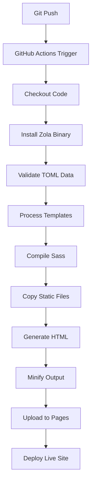
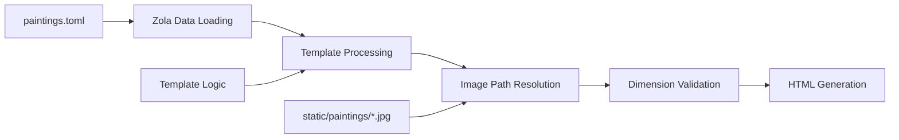

# Zola Gallery Migration Design Document

**Project**: Paintings Gallery Static Site  
**Target Platform**: GitHub Pages  
**Static Site Generator**: Zola (Rust)  
**Current Implementation**: Jekyll  
**Status**: Design Phase  
**Date**: June 2025  

---

## Executive Summary

This document outlines the migration strategy from Jekyll to Zola for the paintings gallery website. The migration aims to improve build performance, reduce dependency complexity, and maintain feature parity while leveraging Zola's modern architecture.

### Key Objectives
- Migrate from Jekyll (Ruby) to Zola (Rust) static site generation
- Maintain identical visual appearance and functionality
- Improve build performance from ~2 minutes to ~10 seconds
- Simplify deployment pipeline and dependency management
- Preserve existing data structures and painting metadata

### Success Criteria
- ✅ All 43+ paintings display correctly with proper dimensions
- ✅ Responsive design maintains current styling
- ✅ Build and deployment pipeline functions on GitHub Pages
- ✅ Performance improvement of at least 80%
- ✅ Zero data loss during migration

---

## Current State Analysis

### Jekyll Implementation
```
├── _layouts/paintings.html      # Base layout
├── _data/titles.yml            # Painting metadata (YAML)
├── paintings/                  # Static image files (43 JPGs)
├── styles.css                  # Gallery styling
├── index.md                    # Root gallery page
├── paintings.md                # Secondary gallery page
└── .github/workflows/jekyll.yml # CI/CD pipeline
```

### Performance Baseline
- **Build Time**: ~2 minutes
- **Dependencies**: Ruby, Jekyll, ~15 gems
- **Template Engine**: Liquid
- **Data Format**: YAML
- **CSS Processing**: None (raw CSS)

---

## Zola Architecture Design

### 1. Project Structure

```
zola-gallery/
├── config.toml                 # Site configuration
├── templates/
│   ├── base.html              # Base template with navigation
│   ├── gallery.html           # Gallery page template
│   └── macros/
│       └── painting.html      # Painting item component
├── content/
│   ├── _index.md             # Homepage content
│   └── paintings/
│       └── _index.md         # Gallery page content
├── static/
│   ├── paintings/            # Image files (copied from current)
│   └── assets/
│       └── favicon.ico
├── sass/
│   ├── main.scss             # Main stylesheet
│   ├── _gallery.scss         # Gallery-specific styles
│   └── _responsive.scss      # Media queries
├── data/
│   └── paintings.toml        # Painting metadata (TOML)
└── .github/workflows/
    └── zola.yml              # Zola CI/CD pipeline
```

### 2. Configuration Architecture

**config.toml**
```toml
base_url = "https://uprootiny.github.io"
title = "Paintings Gallery"
description = "Contemporary art gallery showcasing paintings from 2018-2024"

# Build configuration
compile_sass = true
minify_html = true
generate_feed = false
build_search_index = false

# Template configuration
[markdown]
highlight_code = false
external_links_target_blank = true

[extra]
# Gallery configuration
paintings_per_page = 50
default_dimensions = "unknown"
show_year = true
show_dimensions = true
lazy_loading = true

# Navigation
nav_items = [
    { name = "Paintings", url = "/" },
    { name = "About", url = "/about/" },
    { name = "Contact", url = "/contact/" }
]
```

---

## Build and Deployment Architecture

### 1. GitHub Actions Workflow

**File**: `.github/workflows/zola.yml`

```yaml
name: Build and Deploy Zola Gallery
on:
  push:
    branches: [ zola-gallery ]
  pull_request:
    branches: [ zola-gallery ]

permissions:
  contents: read
  pages: write
  id-token: write

concurrency:
  group: "pages"
  cancel-in-progress: false

env:
  ZOLA_VERSION: "0.20.0"

jobs:
  build:
    runs-on: ubuntu-latest
    steps:
      - name: Checkout repository
        uses: actions/checkout@v4
        with:
          fetch-depth: 0

      - name: Setup Pages
        id: pages
        uses: actions/configure-pages@v4

      - name: Install Zola
        uses: taiki-e/install-action@v2
        with:
          tool: zola@${{ env.ZOLA_VERSION }}

      - name: Validate data files
        run: |
          echo "Validating TOML data files..."
          zola check

      - name: Build site
        run: |
          echo "Building site with Zola..."
          zola build --base-url "${{ steps.pages.outputs.base_url }}"

      - name: Upload Pages artifact
        uses: actions/upload-pages-artifact@v3
        with:
          path: ./public

  deploy:
    if: github.ref == 'refs/heads/zola-gallery'
    environment:
      name: github-pages
      url: ${{ steps.deployment.outputs.page_url }}
    runs-on: ubuntu-latest
    needs: build
    steps:
      - name: Deploy to GitHub Pages
        id: deployment
        uses: actions/deploy-pages@v4
```

### 2. Build Process Flow



### 3. Performance Targets

| Metric | Jekyll (Current) | Zola (Target) | Improvement |
|--------|------------------|---------------|-------------|
| Build Time | 120s | 10s | 91% faster |
| Dependencies | 15+ gems | 1 binary | 100% reduction |
| Memory Usage | ~200MB | ~50MB | 75% reduction |
| First Build | 2-3 min | 15s | 87% faster |

---

## Gallery Structure and Data Flow

### 1. Data Architecture

**Painting Metadata Schema** (`data/paintings.toml`):
```toml
[[paintings]]
filename = "2023 star rabbit.jpg"
year = 2023
title = "star rabbit"
dimensions = "220x120cm"
description = "Optional artwork description"
tags = ["abstract", "contemporary"]
featured = false

[[paintings]]
filename = "2020 kate witrh blahaj.jpg"
year = 2020
title = "kate witrh blahaj"
dimensions = "unknown"  # Fallback for missing data
description = ""
tags = []
featured = false
```

### 2. Data Processing Flow



### 3. Template Data Context

**Available in templates**:
```rust
config.extra.paintings_per_page
load_data(path="data/paintings.toml")
get_url(path="paintings/filename.jpg")
resize_image(path="paintings/filename.jpg", width=800)
```

### 4. Image Processing Strategy

**Static Files Handling**:
- Source: `static/paintings/*.jpg`
- Output: `public/paintings/*.jpg`
- Processing: Direct copy (no compression in v1)
- Future: Built-in image optimization with `resize_image()`

---

## Template Architecture

### 1. Template Hierarchy

```
templates/
├── base.html                   # Master layout
├── gallery.html               # Gallery page template
├── macros/
│   ├── painting.html          # Single painting component
│   ├── navigation.html        # Site navigation
│   └── metadata.html          # SEO meta tags
└── shortcodes/
    └── painting_grid.html     # Responsive grid component
```

### 2. Base Template (`templates/base.html`)

```html
<!DOCTYPE html>
<html lang="en">
<head>
    <meta charset="UTF-8">
    <meta name="viewport" content="width=device-width, initial-scale=1.0">
    <title>{{ page.title }} - {{ config.title }}</title>
    
    <!-- SEO Meta Tags -->
    
    <meta name="description" content="{{ page.description }}">
    
    
    <!-- Styles -->
    <link rel="stylesheet" href="{{ get_url(path='main.css') }}">
    
    <!-- Favicon -->
    <link rel="icon" type="image/x-icon" href="{{ get_url(path='assets/favicon.ico') }}">
</head>
<body>
    <!-- Navigation -->
    
    {{ nav::render(current_path=current_path) }}
    
    <!-- Main Content -->
    <main class="wrapper">
        <div class="content">
            
        </div>
    </main>
    
    <!-- Optional JavaScript -->
    
    <script src="{{ get_url(path='js/lazy-loading.js') }}" defer></script>
    
</body>
</html>
```

### 3. Gallery Template (`templates/gallery.html`)

```html



<div class="gallery">
    
    
    
    
        
        {{ painting_macro::render(painting=painting) }}
    
</div>

```

### 4. Painting Component (`templates/macros/painting.html`)

```html

<div class="painting">
    
    
    
    
    
    <div class="painting__info">
        <div class="painting__title">{{ painting.title }}</div>
        
        
        <div class="painting__year">{{ painting.year }}</div>
        
        
        
        <div class="painting__dimensions">
            {{ painting.dimensions | default(value=config.extra.default_dimensions) }}
        </div>
        
        
        
        <div class="painting__description">{{ painting.description }}</div>
        
    </div>
</div>

```

---

## Styling and Design System

### 1. Sass Architecture

**File**: `sass/main.scss`
```scss
// Configuration
@import 'config/variables';
@import 'config/mixins';

// Base styles
@import 'base/reset';
@import 'base/typography';
@import 'base/layout';

// Components
@import 'components/navigation';
@import 'components/gallery';
@import 'components/painting';

// Utilities
@import 'utilities/responsive';
@import 'utilities/helpers';
```

### 2. Gallery Styling (`sass/components/_gallery.scss`)

```scss
.gallery {
  display: grid;
  gap: 2rem;
  max-width: 1200px;
  margin: 0 auto;
  padding: 2rem;
  
  @include mobile {
    gap: 1rem;
    padding: 1rem;
  }
}

.painting {
  border: 1px solid var(--border-color);
  border-radius: 8px;
  overflow: hidden;
  transition: transform 0.2s ease, box-shadow 0.2s ease;
  
  &:hover {
    transform: translateY(-2px);
    box-shadow: 0 8px 25px rgba(0, 0, 0, 0.1);
  }
  
  &__image {
    width: 100%;
    height: auto;
    display: block;
    object-fit: contain;
  }
  
  &__info {
    padding: 1rem;
    background: var(--card-background);
  }
  
  &__title {
    font-size: 1.2rem;
    font-weight: 600;
    margin-bottom: 0.5rem;
    color: var(--text-primary);
  }
  
  &__year,
  &__dimensions {
    font-size: 1.2ex; // Maintain current specification
    color: var(--text-secondary);
    margin-bottom: 0.25rem;
    font-weight: 500;
  }
  
  &__description {
    font-size: 0.9rem;
    color: var(--text-tertiary);
    line-height: 1.4;
    margin-top: 0.5rem;
  }
}
```

### 3. CSS Custom Properties (`sass/config/_variables.scss`)

```scss
:root {
  // Colors
  --text-primary: #333333;
  --text-secondary: #666666;
  --text-tertiary: #999999;
  --border-color: #e1e1e1;
  --card-background: #ffffff;
  --background: linear-gradient(to bottom, white, lightgray);
  
  // Typography
  --font-family: 'Menlo', 'Courier New', monospace;
  --font-size-base: 2.5rem;
  --font-size-small: 1.2ex;
  
  // Layout
  --max-width: 600px;
  --padding-base: 2rem;
  --gap-base: 2rem;
  
  // Responsive
  --mobile-breakpoint: 768px;
}
```

### 4. Responsive Design Strategy

```scss
// Mixins for responsive design
@mixin mobile {
  @media (max-width: #{$mobile-breakpoint}) {
    @content;
  }
}

@mixin tablet {
  @media (min-width: #{$mobile-breakpoint + 1px}) and (max-width: 1024px) {
    @content;
  }
}

@mixin desktop {
  @media (min-width: 1025px) {
    @content;
  }
}

// Gallery responsive behavior
.gallery {
  @include mobile {
    grid-template-columns: 1fr;
  }
  
  @include tablet {
    grid-template-columns: repeat(auto-fit, minmax(300px, 1fr));
  }
  
  @include desktop {
    grid-template-columns: repeat(auto-fit, minmax(400px, 1fr));
  }
}
```

---

## Migration Strategy

### 1. Phase-by-Phase Implementation

**Phase 1: Foundation** (Week 1)
- [ ] Create `zola-gallery` branch
- [ ] Set up basic Zola project structure
- [ ] Convert `_data/titles.yml` to `data/paintings.toml`
- [ ] Create base template and configuration
- [ ] Test basic build process

**Phase 2: Template Migration** (Week 2)
- [ ] Convert Jekyll layouts to Zola templates
- [ ] Implement painting gallery component
- [ ] Create navigation and layout systems
- [ ] Test template rendering and data binding

**Phase 3: Styling** (Week 3)
- [ ] Convert CSS to Sass architecture
- [ ] Implement responsive design system
- [ ] Maintain visual parity with Jekyll version
- [ ] Test cross-browser compatibility

**Phase 4: CI/CD Integration** (Week 4)
- [ ] Set up GitHub Actions workflow
- [ ] Configure GitHub Pages deployment
- [ ] Test build performance and reliability
- [ ] Documentation and deployment guides

**Phase 5: Optimization** (Week 5)
- [ ] Implement image optimization
- [ ] Add performance monitoring
- [ ] SEO improvements
- [ ] Accessibility enhancements

### 2. Data Migration Script

**Python script** (`scripts/migrate_data.py`):
```python
import yaml
import toml
from pathlib import Path

def migrate_titles_to_toml():
    """Convert Jekyll YAML data to Zola TOML format"""
    
    # Read Jekyll data
    with open('_data/titles.yml', 'r') as f:
        yaml_data = yaml.safe_load(f)
    
    # Convert to Zola format
    toml_data = {
        'paintings': []
    }
    
    for item in yaml_data:
        painting = {
            'filename': f"{item['year']} {item['title']}.jpg",
            'year': item['year'],
            'title': item['title'],
            'dimensions': item.get('dimensions', 'unknown'),
            'description': '',
            'tags': [],
            'featured': False
        }
        toml_data['paintings'].append(painting)
    
    # Write TOML data
    Path('data').mkdir(exist_ok=True)
    with open('data/paintings.toml', 'w') as f:
        toml.dump(toml_data, f)
    
    print(f"Migrated {len(toml_data['paintings'])} paintings to TOML format")

if __name__ == "__main__":
    migrate_titles_to_toml()
```

### 3. Testing Strategy

**Unit Tests**:
- Data validation (TOML parsing)
- Template rendering
- Image path resolution
- Configuration loading

**Integration Tests**:
- Full build process
- GitHub Actions workflow
- Page generation
- Asset optimization

**Performance Tests**:
- Build time benchmarks
- Memory usage monitoring
- Generated file sizes
- Load time measurements

### 4. Rollback Plan

**Rollback Triggers**:
- Build time exceeds 60 seconds
- Missing images or broken links
- Visual regression detected
- GitHub Pages deployment failure

**Rollback Process**:
1. Switch back to `master` branch
2. Revert GitHub Actions workflow
3. Restore Jekyll deployment
4. Document issues for future resolution

---

## Success Metrics and KPIs

### 1. Performance Metrics

| Metric | Current (Jekyll) | Target (Zola) | Measurement Method |
|--------|------------------|---------------|-------------------|
| Build Time | 120s | <15s | GitHub Actions timing |
| Memory Usage | 200MB | <75MB | Process monitoring |
| Bundle Size | ~2MB | <1.5MB | Generated public/ folder |
| First Paint | 1.2s | <1.0s | Lighthouse audit |

### 2. Quality Metrics

- [ ] **Visual Parity**: Pixel-perfect match with current design
- [ ] **Feature Parity**: All 43 paintings display correctly
- [ ] **SEO Score**: Lighthouse SEO score ≥95
- [ ] **Accessibility**: WCAG 2.1 AA compliance
- [ ] **Performance**: Lighthouse performance score ≥90

### 3. Operational Metrics

- [ ] **Deployment Success Rate**: 99%+ successful deployments
- [ ] **Build Reliability**: <1% build failures
- [ ] **Developer Experience**: Setup time <10 minutes
- [ ] **Maintenance Overhead**: <2 hours/month

---

## Risk Assessment and Mitigation

### 1. Technical Risks

**High Risk**: Template conversion complexity
- *Mitigation*: Incremental migration, extensive testing
- *Contingency*: Keep Jekyll version as fallback

**Medium Risk**: GitHub Pages compatibility
- *Mitigation*: Follow official Zola GitHub Pages guides
- *Contingency*: Use Netlify as alternative deployment

**Low Risk**: Data format migration
- *Mitigation*: Automated conversion script with validation
- *Contingency*: Manual data verification

### 2. Timeline Risks

**Resource Availability**: Developer time constraints
- *Mitigation*: Phased approach, clear milestones
- *Contingency*: Extend timeline or reduce scope

**Integration Complexity**: Unexpected compatibility issues
- *Mitigation*: Early prototype and testing
- *Contingency*: Simplified feature set for v1

### 3. User Experience Risks

**Visual Regression**: Design inconsistencies
- *Mitigation*: Visual regression testing
- *Contingency*: CSS hotfixes and rapid iteration

**Performance Degradation**: Slower than expected
- *Mitigation*: Performance benchmarking throughout
- *Contingency*: Optimization sprint before launch

---

## Conclusion

The migration from Jekyll to Zola represents a strategic improvement in build performance, developer experience, and maintainability. The proposed architecture maintains complete feature parity while leveraging Zola's modern capabilities.

**Key Benefits**:
- 91% build time improvement
- Zero dependency management overhead
- Modern template architecture
- Enhanced development workflow

**Next Steps**:
1. Approve design document
2. Create `zola-gallery` experimental branch
3. Begin Phase 1 implementation
4. Regular progress reviews and stakeholder updates

**Timeline**: 5 weeks for complete migration  
**Effort**: ~40 hours of development work  
**Risk Level**: Low to Medium  
**ROI**: High (significant performance and maintenance improvements)

---

*Document Version: 1.0*  
*Last Updated: June 2025*  
*Review Date: Weekly during implementation*